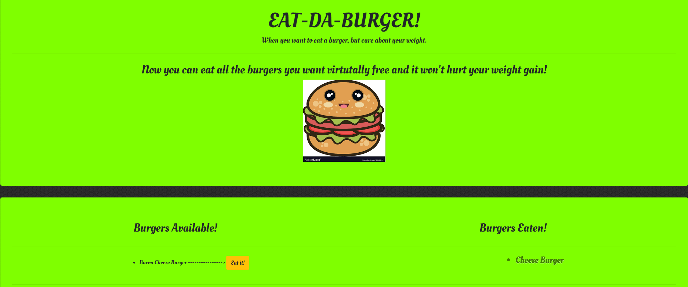

# Eat-Da-Burger

>Link to Github repo https://github.com/lov3tt/burger
>Link to Heroku https://tranquil-ridge-50508.herokuapp.com/ 

>Eat-Da-Burger app

The Eat-Da-Burger app allow you to eat whatever burger you want virtually.

>Feature

1) Save and store data.

2) Guilt-free

3) Incorporate express, express-handlebars, and mysql.

By Bobby Quach
